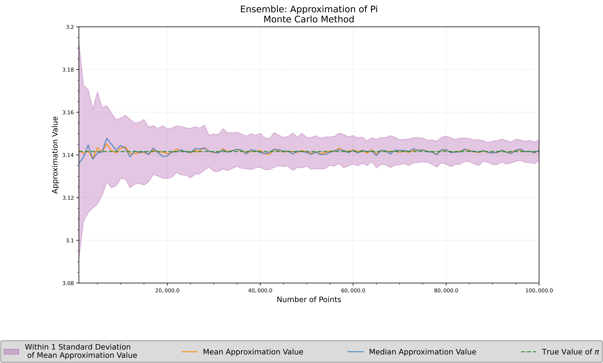
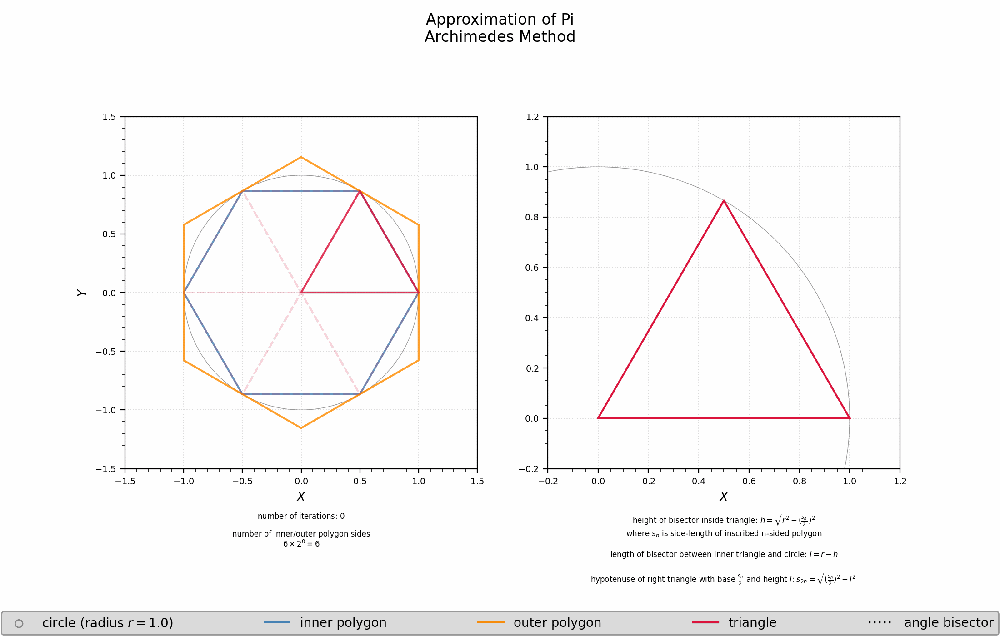
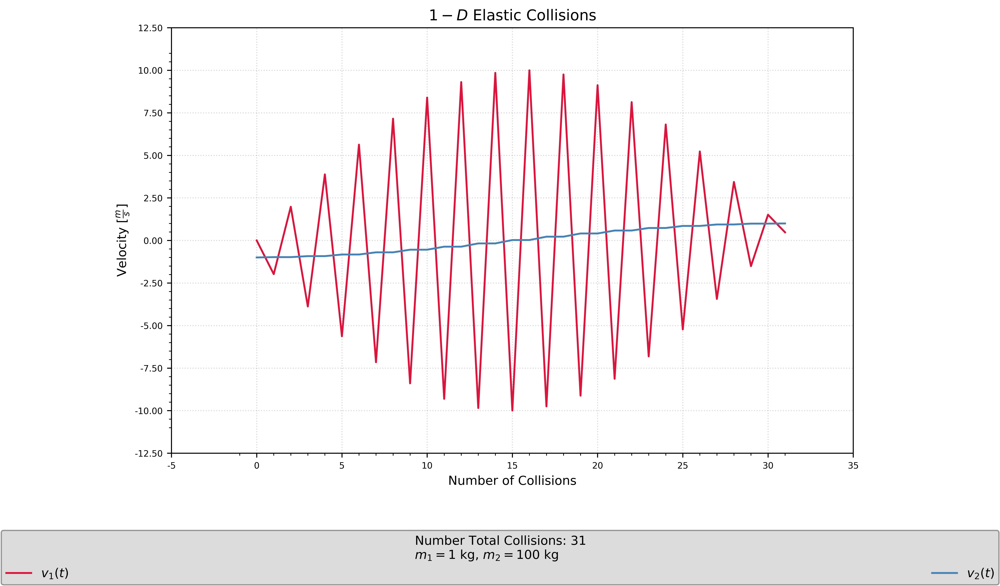
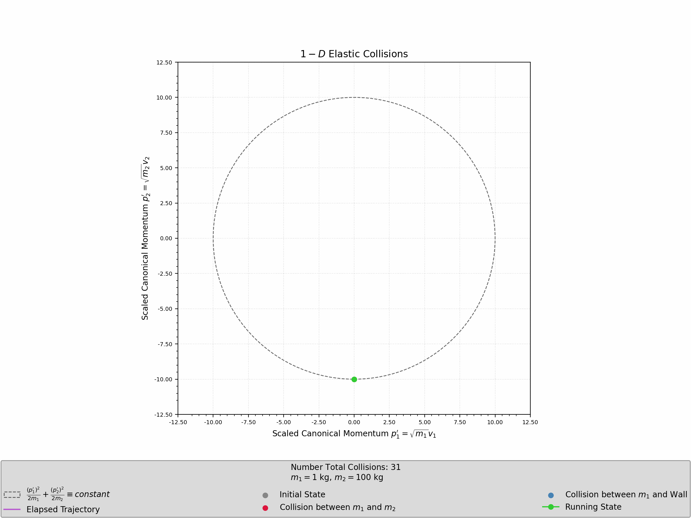
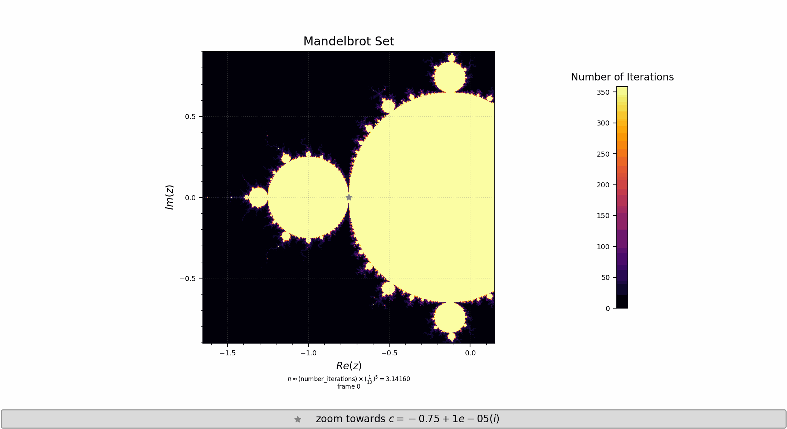

# Repo:    approximating-pi

The purpose of this code is to explore different methods to approximate the mathematical constant pi, given by $\pi \approx 3.14159$.

## Description

This repo contains 4 different methods to approximate:

(1)    Monte Carlo Method

Suppose a circle of radius $r$ is inscribed inside of a square of side-length $l$. This means $2r = l$. The ratio of the areas of the circle to the square is given by $\frac{\pi r^2}{l^2} = \frac{\pi r^2}{(2r)^2} = \frac{\pi}{4}$. Using a uniform random distribution of $N$ points, the number of points inside the circle (given by $N_{circle}$) can be compared to the total number of points inside the square $N$ such that $\pi \approx 4 \cdot \frac{N_{circle}}{N_{square}}$.

Sources:
- [arxiv](https://arxiv.org/ftp/arxiv/papers/1909/1909.13212.pdf)
- [wikipedia](https://en.wikipedia.org/wiki/Approximations_of_pi#/media/File:Pi_monte_carlo_en.gif)

(2)    Archimedes Method

Archimedes used regular $N-$sided polygons to estimate the minimum and maximum perimeters that bound the circumference of a circle. For each $N$, a polygon is inscribed inside the circle (corresponding to lower bound) and another polygon is placed on the outside of the circle (corresponding to upper bound). Each of the starting hexagons have $6$ congruent equilateral triangles. From the center of the circle, the angle bisector for each of these triangles will split each of these triangles into $2$ congruent half-triangles, such that the polygon of sides $2N$ can be inferred.

Sources:
- [blog](https://mathscholar.org/2019/02/simple-proofs-archimedes-calculation-of-pi/)
- [blog](https://www.craig-wood.com/nick/articles/pi-archimedes/)
- [github](https://github.com/umcconnell/archimedes-pi)

(3)    Elastic Collisions (1-D) Method

Consider a $1-$D system of two masses $m_1 = 1$ kg and $\frac{m_2}{m_1} = 10^{n-1}$ such that where $v_1 = 0 \frac{m}{s}$, $v_2 < 0 \frac{m}{s}$, and collisions are perfectely elastic. The momentum of the $i-$th mass is given by $p_i = m_i \cdot v_i$. Elastic collisions allow for conservation of momentum - given by $p_1 + p_2 \equiv k_1$ where $k_1$ is constant - and conservation of energy - given by $\frac{p_1^2}{2m_1} + \frac{p_2^2}{2m_2} = k_2$ where $k_2$ is constant. The number of collisions will then be an under-approximation of $\pi \approx \lfloor \frac{number \space collisions}{10^{n-1}} \rfloor$ up to $n$ digits of precision. The phase-space $p_2$ vs $p_1$ traces out an ellipse, but one can transform this ellipse into a circle by using the scaling $p_1^\prime = \sqrt{m_1} v_1$ and $p_2^\prime = \sqrt{m_2} v_2$, for which the total energy $E^\prime = \frac{(p_1^\prime)^2}{2m_1} + \frac{(p_2^\prime)^2}{2m_2} = 2r$ where $E^\prime$ is constant.

Sources:
- [youtube](https://www.youtube.com/watch?v=HEfHFsfGXjs)
- [arxiv](https://arxiv.org/pdf/1901.06260.pdf)
- [3B1B](https://www.3blue1brown.com/lessons/clacks-solution)

(4)    Mandelbrot Set Method

Consider a complex number $z = x + iy$ such that $f(z) = z^2 + c$ for some constant $c$. If we consider recursive map to get roots $z_{n+1} = z_n^2 + c$ where $z_0 = 1$, then there are a subset of values that constrain $z_{n+1}$ from escaping beyond a cut-off (usually $2$) to infinity. At particular points, the number of iterations can be used to approximate $\pi$. Using $c=-\frac{3}{4} + (\frac{1}{10})^n$ gives the approximation $\pi \approx (\frac{1}{10})^n \cdot number\space iterations$ to $n$ digits of precision.

Sources:
- [youtube](https://www.youtube.com/watch?v=d0vY0CKYhPY)

## Getting Started

### Dependencies

- Python 3.9.6
- numpy == 1.26.4
- matplotlib == 3.9.4

### Executing program

- Download this repository to your local computer
  
- Modify `path_to_save_directory` in the `example.py` file of the repo corresponding to the desired approximation method and run the codes
  

## Version History

- 0.1
  - Initial Release

## To-Do

- Add 2-D Elastic Collisions Method
- Explore 1-D Elastic Collisions Method in base$-12$ and base$-24$
- Vary random seed of Monte Carlo Estimator
- Animate trajectory of roots in Mandelbrot Set

## License

This project is licensed under the Apache License - see the LICENSE file for details.
